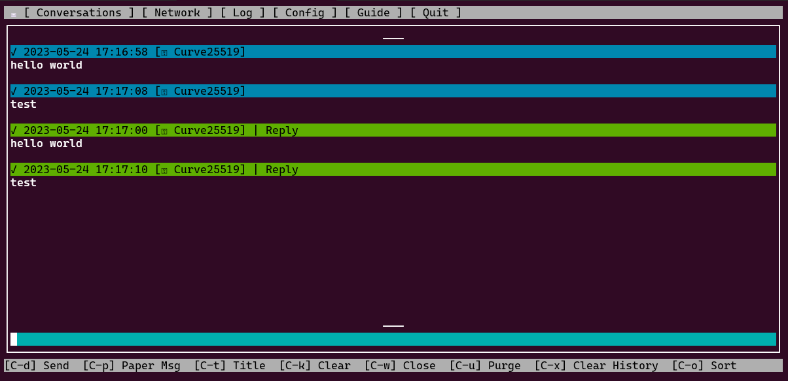

# LXMFBot

Python class to easily develop a simple Telethon style chatbot for the LXMF protocol.



## Installation

```
$ pip install -r requirements.txt
```

## Usage

- Instantiate the class with a `name` for the bot as parameter. 
  - Two additional options the class takes as parameters are `announce` to define the announce interval in seconds (defaults to `360`) and an `announce_immediately` boolean to define whether the bot should announce itself immediately after instantiation or not (defaults to `False`)
- Use the `received` decorator to define functions for parsing received messages
- Use the `<instance>.send(recipient_hash, message)` or `msg.reply(message)` methods to send messages
- Launch the bot using the `run` method

### Message Object

Functions decorated by `received` have access to a `msg` parameter that has the following content:

- `msg.sender` : the sender hash address
- `msg.content`: the received message as utf-8 string
- `msg.reply` : function that takes a string parameter and sends it as reply to the sender
- `msg.lxmf` : the complete `LXMessage` object for more complex parsing

### Example

Example of a bot that echos a message back to the sender:

```Python
from lxmfbot import LXMFBot

bot = LXMFBot("NodeBot")

@bot.received
def echo_msg(msg):
    msg.reply(msg.content)

bot.run()
```

### Identity & Announce Files

The bots' identity and announce file location

| OS | Path |
|:-- |:--- |
| Linux: | `~/.local/share/LXMFBot/<botname>` |
| MacOS: | `~/Library/Application Support/LXMFBot/<botname>` |
| Windows: | `C:\Users\<username>\AppData\Local\LXMFBot\<botname>` |